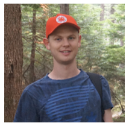

## Massive Choice, Ample Tasks (MaChAmp)

<div style="text-align: justify">
This websites introduces MaChAmp and provides an overview of code and papers that use MaChAmp.	 
</div>

## Abstract
<blockquote>
    <div style="text-align: justify">
        Transfer learning, particularly approaches that combine multi-task learning with pre-trained contextualized embeddings and fine-tuning, have advanced the field of Natural Language Processing tremendously in recent years. In this paper we present MaChAmp, a toolkit for easy fine-tuning of contextualized embeddings in multi-task settings. The benefits of MaChAmp are its flexible configuration options, and the support of a variety of natural language processing tasks in a uniform toolkit, from text classification and sequence labeling to dependency parsing, masked language modeling, and text generation. 
    </div> 
</blockquote>
* [pdf](https://arxiv.org/abs/2005.14672)
* [code with extensive README](https://github.com/machamp-nlp/machamp)
* [tutorial video](https://www.youtube.com/watch?v=DauTEdMhUDI)

## Contributors

<table id='contributor-table'>
  <tr>
    <td>
      
    </td>
    <td>
      
    </td>
    <td>
      
    </td>
      <td>
      
    </td>
    <td>
      
    </td>
  </tr>
  <tr>
    <td>
      <div class='names'><a href="http://www.robvandergoot.com/">Rob van der Goot</a></div>
    </td>
    <td>
      <div class='names'><a href="https://ahmetustun.github.io">Ahmet Üstün</a></div>
    </td>
    <td>
      <div class='names'><a href="https://alanramponi.github.io/">Alan Ramponi</a></div>
    </td>
    <td>
      <div class='names'><a href="https://www.linkedin.com/in/ibrahimsharafelden/">Ibrahim Sharaf</a></div>
    </td>
    <td>
      <div class='names'><a href="https://bplank.github.io/">Barbara Plank</a></div>
    </td>
  </tr>
</table>

## Acknowledgments

This research was supported by an <a href="https://ara.amazon-ml.com/recipients/#2018">Amazon Research Award</a>, an STSM in the Multi3Generation
COST action (CA18231), a visit supported by
COSBI, grant 9063-00077B (Danmarks Frie
Forskningsfond), and Nvidia corporation for sponsoring Titan GPUs. We thank the NLPL laboratory
and the HPC team at ITU for the computational
resources used in this work.

<br>
<br>

## Papers that use MaChAmp

### v0.1

* [Biomedical Event Extraction as Sequence Labeling](https://www.aclweb.org/anthology/2020.emnlp-main.431/) (EMNLP 2020)
* [Character-level Representations Improve DRS-based Semantic Parsing Even in the Age of BERT](https://www.aclweb.org/anthology/2020.emnlp-main.371/) (EMNLP 2020)
* [DaN+: Danish Nested Named Entities and Lexical Normalization](https://www.aclweb.org/anthology/2020.coling-main.583/) (Coling 2020)

### v0.2

* [Challenges in Annotating and Parsing Spoken, Code-switched, Frisian-Dutch Data](https://robvanderg.github.io/doc/adapt-nlp2021.2.pdf) (Adapt-NLP 2021)
* [Lexical Normalization for Code-switched Data and its Effect on POS-tagging](https://arxiv.org/abs/2006.01175) (EACL 2021)
* From Masked-Language Modeling to Translation: Non-English Auxiliary Tasks Improve Zero-shot Spoken Language Understanding (NAACL 2021)


## Citation
```
@inproceedings{vandergoot-etal-2020-machamp,
    title={Massive {C}hoice, {A}mple Tasks ({MaChAmp}): A Toolkit for Multi-task Learning in {NLP}},
    author={Rob van der Goot and Ahmet {\"U}st{\"u}n and Alan Ramponi and Sharaf, Ibrahim and Barbara Plank},
    booktitle = "Proceedings of the 16th Conference of the {E}uropean Chapter of the Association for Computational Linguistics: Volume 1, Long Papers",
    month = feb,
    year = "2021",
    publisher = "Association for Computational Linguistics",
}


```

<!-- ### Credits
<p>
<small>Website adapted from: <a href="https://continual-vista.github.io/">https://continual-vista.github.io/</a></small>
</p>--> 
